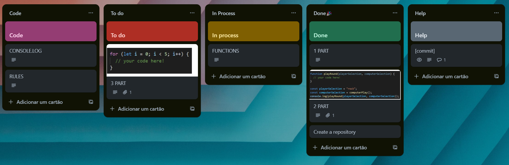

# 💻 KREATIVSTORM Project 

## ✏️ Project description
Our goal was to create a game of rock, paper, scissors.

## 👩‍💻 Development Rules
- use JS only
- have 5 rounds
- show the winner in each round and their points and the final winner
- validate input data as the user enters

## 🪧 Game Rules
👊 Rock beats scissors
✌️ Scissors beats paper
✋ Paper beats rock

## 🎯 Organization of tasks
Using the Trello 

## 💻How it works?
The player chooses an option between rock, paper and scissors and the computer randomly selects another option. To see the results you need to go to console.log clicking *F12* or right button on the browser and go to inspect and go to the console.

## 👩‍💻 Squad
| Dev    | Github |
| -------- | ------- |
| Filip | https://github.com/FilipCern   |
| Khawla | https://github.com/Khawla-1006   |
| Stefan    | https://github.com/stefananghel93   |
| Tamara   | https://github.com/tamaracosta  |